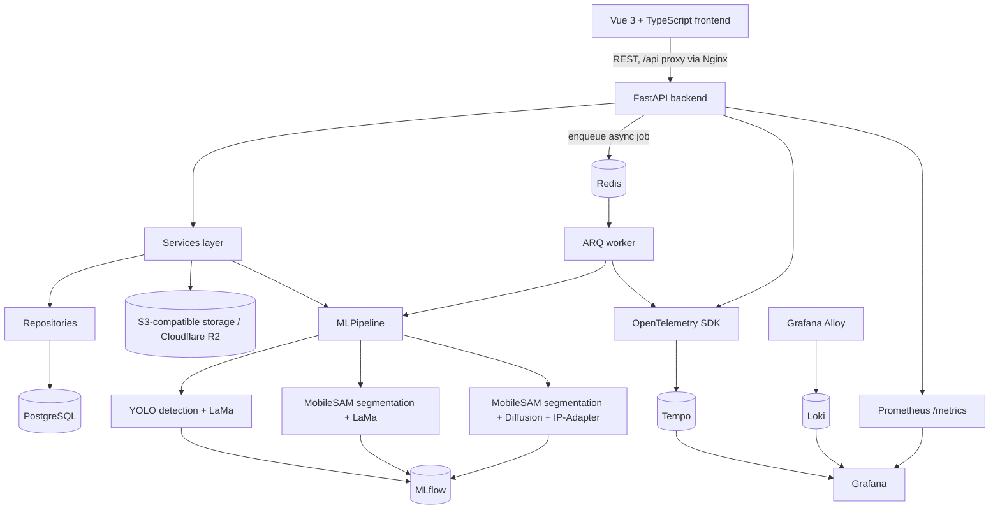

# AI Photo Object Editor

Full-stack AI image editing platform. Detect or segment an object in a photo, then remove or replace it — via classical inpainting or diffusion-based generation — with heavy ML work running asynchronously and every inference call tracked in MLflow.

## Overview

AI Photo Object Editor lets a user upload a photo, select an object either by **object detection (YOLO)** or by **segmentation (MobileSAM)**, and then edit it: remove it, replace it with another image, or — for segmented objects — generatively replace it with a diffusion model steered by a reference image. Edits are versioned (undo/redo/save/reset), extracted objects can be saved to a reusable asset library, and every detection/segmentation/inpainting/diffusion call is executed by a FastAPI backend, offloaded to an ARQ worker for the async endpoints, and logged to MLflow.

The two object-selection mechanisms — detection and segmentation — lead to **distinct editing paths**, not one linear pipeline:

- **YOLO detection → LaMa inpainting** (removal or paste-style replacement of a detected bounding box)
- **MobileSAM segmentation → LaMa inpainting** (removal or paste-style replacement of a precise mask)
- **MobileSAM segmentation → Diffusion replacement** (Stable Diffusion inpainting + IP-Adapter, reference-image-guided)

Diffusion-based replacement is reachable only from a segmentation mask, never from a raw YOLO bounding box — this is a deliberate engineering trade-off, explained in [ML Pipeline](#ml-pipeline) below.

## Features

### Computer Vision
- Object detection (YOLO) with confidence threshold and class filtering, returning bounding boxes
- Segmentation (MobileSAM):
  - **Automatic** — unprompted, "segment everything" over the image
  - **Prompted** — a bounding box supplied by the user
  - **Polygon** — a freehand polygon, optionally smoothed and feathered
  - **Hybrid** — YOLO detects common objects first, MobileSAM segments each of those boxes in a single batched encoder pass, then a sparse MobileSAM auto-pass fills in objects YOLO missed (see [Hybrid Segmentation](#hybrid-segmentation))
- Object extraction: turn a MobileSAM mask into a standalone RGBA cutout, saved as a reusable asset, and pasted back into any image

### Image Editing
- **Remove** a YOLO-detected object (LaMa inpainting) — single or multiple bounding boxes in one pass
- **Replace** a YOLO-detected object with an uploaded image (LaMa fill + paste, with optional color matching / edge blending)
- **Remove** a MobileSAM-segmented object (LaMa inpainting on the precise mask)
- **Replace** a MobileSAM-segmented object with an uploaded image or a saved asset (LaMa + paste + color matching)
- **Replace** a MobileSAM-segmented object via **diffusion** (Stable Diffusion inpainting + IP-Adapter), steered by an uploaded reference image or a saved asset, with an optional text prompt

### Application
- JWT authentication: signup with email confirmation, login, password recovery/reset, profile management
- Image upload, listing, download, presigned URL, deletion
- Version history: current working state, undo, redo, reset to original, save as a new version
- Asset library: list, rename/patch, delete extracted objects; paste an asset into any image
- Every ML operation (detect, segment*, remove*, replace*, sam_*, extract) has both a synchronous endpoint and an `/async` job variant, polled via a job-status endpoint

## Architecture



The three `PIPELINE` branches are the only ML editing paths — YOLO detection feeds LaMa only, MobileSAM segmentation feeds either LaMa or the diffusion/IP-Adapter path. There is intentionally no edge from YOLO to the diffusion node; see [ML Pipeline](#ml-pipeline) for why.

- **Frontend** (`frontend/`) — Vue 3 + TypeScript SPA (Vite, Pinia, Vue Router, PrimeVue), served by Nginx in production, which reverse-proxies `/api/` to the backend.
- **API layer** (`backend/app/api`) — FastAPI routers: `auth`, `users`, `images`, `detections`, and the `/ml` namespace (`detect`, `segmentation`, `sam_ops`, `editing`, `session`, `assets`, `jobs`).
- **Services** (`backend/app/services`) — business logic per domain: `ImageService`, `DetectionService`, `UserService`, `MLJobService`, and ML-specific services (`DetectorService`, `SegmentationService`, `EditingService`, `AssetService`, plus version-history/carry-forward helpers) that call into `MLPipeline`.
- **Repositories** (`backend/app/repository`) — one repository per DB entity; each method opens and closes its own short-lived DB session, so a repository call never holds a Postgres connection open for the duration of a long GPU inference.
- **ML pipeline** (`backend/app/ml`) — see [ML Pipeline](#ml-pipeline) below; full internals are in [`docs/ML_PIPELINE.md`](docs/ML_PIPELINE.md).
- **Storage** (`backend/app/storage`) — S3-compatible object storage for images/assets (`S3Storage`, via `aioboto3`), and Redis-backed storage for transient editor state, cached results, and edit history (`RedisStorage`, `RedisHistory`, `RedisAssetsStorage`).
- **Workers** (`backend/app/workers/worker.py`) — an ARQ worker exposing one task per async ML operation, with a background resource-monitor loop that logs thread count, memory (RSS/VMS), open files/connections, and CUDA memory usage every 60 seconds.

## ML Pipeline

`MLPipeline` (`backend/app/ml/pipeline/pipeline.py`) is the single orchestrator the services and worker call into. It composes two independent modes:

```python
class MLPipeline(DetectionMixin, RemovalMixin, ReplacementMixin, SegmentationMixin, ExtractionMixin):
    self.yolo_lama_mode = get_yolo_lama_mode()   # YOLO detection + LaMa inpainting
    self.sam_lama_mode  = get_sam_mode()         # MobileSAM segmentation + LaMa OR Diffusion
```

### Path A — YOLO detection → LaMa

```
Image → YOLO detection → bounding box(es) selected by the user → LaMa inpainting → result
```

`YOLODetector` (Ultralytics YOLO, default weights `weights/yolov10m.pt`) returns bounding boxes with class and confidence. The user selects one or more boxes in the editor; `remove_object` / `remove_multiple_objects` / `replace_object` (in `MLPipeline`'s `RemovalMixin` / `ReplacementMixin`, backed by `YoloLamaMode`) convert the bounding box into a mask — expanded outward by a configurable pixel margin, clamped so the expansion doesn't bleed into a neighboring detection's box — and pass it to `LaMaInpainter`. Replacement additionally accepts an uploaded image, pastes it into the box, and applies color matching / edge blending. **There is no diffusion path from a YOLO bounding box** — the corresponding `YoloLamaMode` has no diffusion method, and the API's diffusion endpoint requires a segmentation mask (see below), not a `bbox_id`.

### Path B — MobileSAM segmentation → LaMa

```
Image → segmentation prompt (auto / bbox / polygon / hybrid) → MobileSAM mask → LaMa inpainting → result
```

`MobileSAMSegmentor` (MobileSAM, ViT-T backbone, weights `weights/mobile_sam.pt`) produces a pixel-accurate mask instead of a box. `sam_remove_object` / `sam_replace_object` (backed by `SAMLamaMode`) feed that mask into the same `LaMaInpainter` used by Path A, then apply color matching / edge blending.

### Path C — MobileSAM segmentation → Diffusion

```
Image → segmentation prompt → MobileSAM mask → Stable Diffusion inpainting + IP-Adapter (reference image / asset, optional text prompt) → result
```

`sam_replace_object_diffusion` (backed by `SAMLamaMode.replace_object_diffusion`, using `DiffusionReplacer`) replaces the segmented region generatively: crop to the mask's bounding box with padding, upscale the crop to a fixed working resolution, run `AutoPipelineForInpainting` (default model `stable-diffusion-v1-5/stable-diffusion-inpainting`, DPM-Solver++ scheduler) conditioned on a reference image via IP-Adapter (`h94/IP-Adapter`) and an optional text prompt, decode in fp32 with a NaN check, then downscale and feather-blend the result back into the original frame. The corresponding API endpoint (`POST /ml/images/{id}/replace/diffusion`) requires a `mask_file` (the binary SAM mask returned by a segmentation call) — there is no equivalent endpoint that accepts a `bbox_id`.

### Why diffusion is segmentation-only

This is an intentional performance and quality trade-off, not a missing feature. In this project's current configuration, diffusion replacement typically takes approximately **6–18 minutes for a relatively small segmented region** on the available hardware — this is a project-specific, current-hardware observation, not a general benchmark. YOLO-selected regions are typically larger (a rectangular bounding box around a whole object rather than its precise silhouette), and diffusing a larger area would increase generation time further, increase GPU memory pressure, and tends to produce less controllable results for this use case. Restricting diffusion to segmentation-selected regions keeps the generative path bounded to precisely the pixels being replaced.

### Hybrid Segmentation

`segment_hybrid` (`backend/app/services/ml/segmentation_service.py`) is a two-stage segmentation strategy, not a separate editing path:

1. Run YOLO detection once (bounding boxes are used internally as prompts, not persisted as detections).
2. Feed all YOLO boxes to MobileSAM in a single batched encoder pass (`sam_segment_with_prompts_batch`) to get precise masks for the "common" objects YOLO already found.
3. Run a sparse MobileSAM auto-segmentation pass over the whole image and keep only the segments that don't overlap (by IoU) an already-covered YOLO box, to catch anything YOLO missed.

The result is a set of MobileSAM masks (each tagged `source: "yolo"` or `source: "sam_auto"`) — functionally identical to any other segmentation result. Those masks are then edited through the same Path B / Path C endpoints (`sam_ops`, `/replace/diffusion`) as masks from auto, prompted, or polygon segmentation. In other words, Hybrid mode uses YOLO to seed MobileSAM faster than a full auto pass — it does not create a YOLO→Diffusion path; diffusion is still reached only via a MobileSAM mask.

### Detection vs. segmentation

| | Detection (YOLO) | Segmentation (MobileSAM) |
|---|---|---|
| Output | Axis-aligned bounding box | Pixel-accurate mask |
| Precision | Object-level localization | Precise boundary, follows object silhouette |
| Editing backends | LaMa only | LaMa or Diffusion |
| Typical use | Fast, coarse selection | Precise selection, required for generative replacement |

### Component responsibilities

| Component | File | Responsibility |
|---|---|---|
| `YOLODetector` | `backend/app/ml/detector.py` | Ultralytics YOLO wrapper: async detection, confidence/class filtering, metrics |
| `MobileSAMSegmentor` | `backend/app/ml/segmentor.py` | MobileSAM wrapper: automatic and prompted (point/bbox) segmentation, metrics |
| `LaMaInpainter` | `backend/app/ml/inpainter.py` | LaMa inpainting via `iopaint`: object removal and paste-style replacement |
| `DiffusionReplacer` | `backend/app/ml/diffuser_inpainter.py` | Stable Diffusion inpainting + IP-Adapter: reference-image-guided generative replacement |
| `YoloLamaMode` | `backend/app/ml/modes/yolo_lama_mode.py` | Orchestrates YOLO detection + LaMa for Path A |
| `SAMLamaMode` | `backend/app/ml/modes/sam_lama_mode.py` | Orchestrates MobileSAM segmentation + LaMa/Diffusion for Paths B and C, plus object extraction |
| `MLPipeline` | `backend/app/ml/pipeline/pipeline.py` | Top-level orchestrator combining both modes, used by services and the worker |
| `ExperimentTracker` | `backend/app/ml/experiment_tracker.py` | Logs one MLflow run per ML call (params + metrics + tags) |
| `ModelManager` | `backend/app/ml/model_manager.py` | MLflow model/pipeline registration, versioning, stage promotion, version comparison |
| Processors | `backend/app/ml/processors/` | `edge_blender`, `color_matcher`, `background_remover`, `image_compositor`, `polygon_mask` — shared post-processing used by both modes |

Full implementation detail for every component above is in [`docs/ML_PIPELINE.md`](docs/ML_PIPELINE.md).

## Object Extraction

```
MobileSAM mask → RGBA crop (padding around the mask) → saved asset → pasted back into any image
```

`sam_extract_object` crops the segmented region to an RGBA cutout (transparent outside the mask) and saves it as an asset. `sam_paste_extracted_object` / the `/assets/paste` endpoint takes a saved asset (or an uploaded image, for LaMa/diffusion replacement) and composites it back into an image, with optional color matching and edge blending. Extraction is MobileSAM-only — there is no YOLO-bbox-based extraction endpoint.

## Image Editing Workflow

```
Upload → Detect (YOLO) or Segment (auto / bbox / polygon / hybrid, MobileSAM)
       → Select object
       → Remove, or Replace via LaMa, or (segmentation only) Replace via Diffusion
       → Color match / Edge blend
       → Working state updated
       → Undo / Redo / Reset / Save
```

Current working state, undo/redo, and edit history are backed by Redis (`RedisHistory`) and committed as versioned rows in PostgreSQL. `POST /ml/images/{id}/save` commits the current state as a new `ImageVersion`; `POST /ml/images/{id}/reset` reverts to the original upload.

## Async ML Jobs

```
Frontend → FastAPI POST .../async → ARQ enqueue → Redis → ARQ worker
         → MLPipeline call → result → GET /ml/jobs/{job_id}
```

Every ML endpoint has a synchronous version and an `/async` version. The async version enqueues an ARQ task (`backend/app/workers/worker.py`) and immediately returns `{"job_id": ...}`. `GET /ml/jobs/{job_id}` polls status via `arq.jobs.Job`, returning `status` (`deferred` | `queued` | `in_progress` | `complete` | `not_found`), and — once `complete` — either `result` or `error`. The worker is configured with `max_jobs = 1` (one job at a time, since GPU inference isn't easily parallelized on a single device) and warms up the `MLPipeline` singleton on startup so the first request after boot doesn't pay full model-load latency.

## Authentication and Security

JWT-based auth (`python-jose`, HS256, configurable expiry) with bcrypt password hashing (`passlib`):

- `POST /auth/signup` → creates the account, sends a confirmation email (`fastapi-mail`)
- `POST /auth/signup-confirmation` → confirms the account via the emailed token
- `POST /auth/login` → returns a bearer access token (`OAuth2PasswordBearer`, token URL `/auth/login`)
- `POST /auth/password-recovery` / `PATCH /auth/reset-password` → password recovery flow
- `GET/PATCH /users/me`, `PATCH /users/me/password`, `DELETE /users/me` → profile management, all requiring a valid bearer token

On the frontend, `stores/auth.ts` (Pinia) holds the auth state and `router/index.ts` guards routes via `meta: { requiresAuth }` / `meta: { guest }`, redirecting unauthenticated users to `/login` and authenticated users away from guest-only pages.

## Storage

- **PostgreSQL** — system of record: users, images, image versions/content, detections, segmentation masks, edit history, ML jobs, assets (SQLAlchemy async engine, migrations via Alembic).
- **Redis** — transient editor/session state, cached results, and undo/redo history; not the system of record.
- **S3-compatible object storage (Cloudflare R2)** — uploaded images, edited results, and extracted assets, accessed via `aioboto3`.

## Observability

- **Logging** — `structlog`-based structured logging (`backend/app/core/logging`), with request context bound by `RequestLoggingMiddleware` and job context bound by the `@log_job` decorator used on every ARQ task.
- **Tracing** — OpenTelemetry instrumentation for FastAPI (`FastAPIInstrumentor`) and worker jobs (`@trace_job`), exported to **Tempo**.
- **Metrics** — `prometheus-fastapi-instrumentator` exposes `/metrics` on the API; `nvidia_gpu_exporter` exposes GPU metrics; both scraped by **Prometheus**.
- **Log aggregation** — **Grafana Alloy** ships logs to **Loki**.
- **Dashboards** — **Grafana**, provisioned with Loki/Prometheus/Tempo datasources (`observability/grafana-datasources.yml`).
- **ML experiment tracking** — **MLflow**: every detection/segmentation/inpainting/diffusion call is logged as one run (params + metrics + tags) via `ExperimentTracker.log_run()`; `ModelManager.register_pipeline()` can bundle the latest run of each stage into one versioned, registered pipeline artifact.

## Testing

Backend (`backend/tests`, config in `backend/tests/pytest.ini`, `asyncio_mode = auto`):

- `unit/` — api, core, logging, ml, models, repository, schemas, services, storage, worker
- `integration/` — api, logging, ml, repository, services, storage (with mocked/real dependencies as noted per test)
- `smoke/` — end-to-end tests marked `@pytest.mark.gpu`; these run against a **live** stack over HTTP (`httpx`, default `http://localhost:8000`, overridable via `SMOKE_API_URL`) and require the real ARQ worker with SAM/LaMa/Diffusion loaded on CUDA — they are not run in-process

Frontend (`frontend/tests/unit`, Vitest): stores, views, api clients, composables.

```bash
# Backend — from backend/
pytest                    # unit + integration
pytest -m gpu             # smoke tests, against a running stack with a GPU worker
pytest -m "not gpu"       # everything except the live/GPU smoke suite

# Frontend — from frontend/
npm test
```

## CI/CD

`.github/workflows/` defines four workflows:

- **`ci.yml`** — runs on every push/PR to `main`/`develop`. Lints and type-checks the backend (`ruff`, `mypy`), runs backend unit tests, then integration tests against real Postgres/Redis service containers, then non-GPU smoke tests, and separately lints/type-checks/tests/builds the frontend (`vue-tsc`, `vitest`, `vite build`). It also does a no-push Docker build of both images and validates that `docker-compose.prod.yml`, `docker-compose.override.yml`, and `docker-compose.test.yml` overlay/parse correctly against the base `docker-compose.yml` via `scripts/validate-compose.sh`. A final `ci-success` gate job requires all of the above to pass.
- **`gpu_tests.yml`** — a separate, manually-triggered (`workflow_dispatch`) workflow that runs on a self-hosted GPU runner, since YOLO/MobileSAM/LaMa/diffusion tests need real CUDA hardware that GitHub's hosted runners don't provide. It can run all GPU suites or a single one (`yolo`, `sam`, `lama`, `diffusion`).
- **`cd.yml`** — triggers after a successful `CI` run on `main` (or manually), builds and pushes backend/frontend images to GHCR, then deploys over SSH: runs Alembic migrations against the new image, restarts the stack with `docker-compose.yml` + `docker-compose.prod.yml`, and runs `scripts/health-check.sh` (API health, DB/Redis status, and a worker crash-loop stability window). A failed health check triggers an automatic rollback to the previously deployed image tag.
- **`rollback.yml`** — a manually-triggered, confirmation-gated workflow to roll production back to a specific image tag or the last known-good deployment, reusing the same health check.

## Tech Stack

| Layer | Technology |
|---|---|
| Backend | Python 3.11, FastAPI, SQLAlchemy (async), Alembic |
| Frontend | Vue 3, TypeScript, Vite, Pinia, Vue Router, PrimeVue |
| Database | PostgreSQL 16 |
| Cache / Queue | Redis 7, ARQ |
| Object storage | S3-compatible (Cloudflare R2) via aioboto3 |
| Detection | Ultralytics YOLO |
| Segmentation | MobileSAM |
| Inpainting | LaMa (`iopaint`) |
| Diffusion replacement | Stable Diffusion (`diffusers`) + IP-Adapter |
| Experiment tracking / model registry | MLflow |
| Auth | JWT (`python-jose`), `passlib`/`bcrypt`, `fastapi-mail` |
| Observability | OpenTelemetry, Prometheus, Grafana, Loki, Alloy, Tempo, `nvidia_gpu_exporter` |
| Containerization | Docker, Docker Compose |
| Testing | Pytest / Pytest-asyncio, Vitest |

## Project Structure

```
backend/           # FastAPI backend, ML pipeline, workers, tests
frontend/          # Vue 3 + TypeScript frontend
observability/      # Prometheus, Grafana, Loki, Alloy, Tempo configuration
scripts/            # model download and deployment/validation scripts
docs/               # technical documentation
.github/workflows/  # CI/CD workflows
docker-compose*.yml
README.md
```

The responsibilities of the components inside `backend/app` are covered above in [Architecture](#architecture) and [ML Pipeline](#ml-pipeline), and in [`docs/ML_PIPELINE.md`](docs/ML_PIPELINE.md); auth, storage, and observability internals are covered in their own sections below.

## Requirements

- Python 3.11
- Node.js compatible with Vite 8 / Vue 3.5
- Docker & Docker Compose
- An NVIDIA GPU with the NVIDIA Container Toolkit — `docker-compose.yml` requests `gpus: all` for the `app` and `worker` services, and `requirements.txt` installs PyTorch from the CUDA 12.4 wheel index (`torch==2.5.1`). `DeviceManager` falls back to CPU automatically if `torch.cuda.is_available()` is `False`, but `SAM_DEVICE` and `LAMA_DEVICE` default to `cuda` while `YOLO_DEVICE` defaults to `cpu` — segmentation, LaMa, and diffusion are the operations expected to need a GPU in practice.
- Model weight files under `backend/weights/`, fetched via `scripts/download-models.sh` / `.ps1` — see below.

## Model Weights

Model binaries are **not committed to Git** — `backend/.gitignore` excludes `*.pt`, `*.onnx`, and everything under `backend/weights/` except a set of tracked `.gitkeep` files (`backend/weights/.gitkeep`, `backend/weights/lama_cache/.gitkeep`, `backend/weights/rembg/.gitkeep`) that preserve the directory structure the app expects. The weights themselves are fetched with a download script rather than placed by hand:

- **Linux / WSL:** `scripts/download-models.sh`
- **Windows:** `scripts/download-models.ps1`

Both scripts create `backend/weights/`, `backend/weights/lama_cache/`, and `backend/weights/rembg/` if missing, skip any file that's already present, and download:

| Model | Destination | Source |
|---|---|---|
| YOLOv10m | `backend/weights/yolov10m.pt` | `ultralytics/assets` release |
| MobileSAM (ViT-T) | `backend/weights/mobile_sam.pt` | `ultralytics/assets` release |
| LaMa / big-lama | `backend/weights/lama_cache/big-lama.pt` | `Sanster/models` release |
| rembg / U2Net | `backend/weights/rembg/u2net.onnx` | `danielgatis/rembg` release |

`YOLODetector` and `MobileSAMSegmentor` load `yolov10m.pt` / `mobile_sam.pt` directly by path. LaMa is different: `iopaint` expects its checkpoint inside the Torch hub checkpoint cache (`~/.cache/torch/hub/checkpoints`), not at an arbitrary path — so `docker-compose.yml` mounts `./backend/weights/lama_cache` to `/root/.cache/torch/hub/checkpoints` inside the `app` and `worker` containers. Downloading `big-lama.pt` into `lama_cache/` before the containers start means IOPaint finds it already in place, and the mount keeps it there across container recreation instead of re-downloading it into an ephemeral container filesystem. rembg is pointed at the same tree via `U2NET_HOME=/app/weights/rembg`. Stable Diffusion and IP-Adapter weights are the one exception that still self-download — `diffusers`' `AutoPipelineForInpainting.from_pretrained(...)` and the IP-Adapter weights (`h94/IP-Adapter`) are pulled from the Hugging Face Hub on first use and cached by `huggingface_hub`'s default cache, not by either download script.

In short: run the download script for your platform before first launch to populate YOLO, MobileSAM, LaMa, and rembg; the diffusion stack downloads itself on first inference call.

## Scripts

`scripts/`:

- **`download-models.sh`** (Linux/WSL) / **`download-models.ps1`** (Windows) — fetch YOLOv10m, MobileSAM, LaMa, and rembg weights into `backend/weights/` (see [Model Weights](#model-weights)). Run once before first launch: `./scripts/download-models.sh`.
- **`validate-compose.sh`** — validates that a Compose overlay (`docker-compose.prod.yml`, `.override.yml`, or `.test.yml`) merges cleanly with the base `docker-compose.yml` and doesn't introduce orphan service names; used by `ci.yml`. Example: `./scripts/validate-compose.sh docker-compose.prod.yml`.
- **`health-check.sh`** — polls the API's `/health` endpoint, reports the DB/Redis status exposed by that endpoint (it does not connect to Postgres/Redis directly), verifies the `app` container is running, and watches the `worker` container for a crash-loop over a stability window; used by `cd.yml` and `rollback.yml` after a deploy. Example: `./scripts/health-check.sh http://localhost:8000`.

## Installation

### 1. Clone

```bash
git clone https://github.com/nazarpalamarenkoo-ui/AI-Photo-Object-Editor.git
cd AI-Photo-Object-Editor
```

### 2. Environment variables

```bash
cp backend/.env.example .env
```

Fill in the root-level `.env` — grouped as in `backend/.env.example` (the template lives under `backend/`, but `docker-compose.yml` reads `.env` from the project root via `env_file: - .env`, so the populated file must live at the repo root, not inside `backend/`): database (`DATABASE_URL`, `ALEMBIC_DATABASE_URL`, `POSTGRES_USER`, `POSTGRES_PASSWORD`, `POSTGRES_DB`), cache/queue (`CACHE_TYPE`, `REDIS_URL`, `REDIS_HOST`, `REDIS_PORT`), object storage (`ACCESS_KEY`, `SECRET_KEY`, `R2_ENDPOINT`, `S3_BUCKET`, `R2_PUBLIC_URL`), MLflow (`MLFLOW_TRACKING_URI`), auth/mail (`SECRET_KEY_AUTH`, `MAIL_USERNAME`, `MAIL_PASSWORD`, `MAIL_FROM`, `MAIL_PORT`, `MAIL_SERVER`, `MAIL_STARTTLS`, `MAIL_SSL_TLS`, `USE_CREDENTIALS`), device selection (`YOLO_DEVICE`, `SAM_DEVICE`, `LAMA_DEVICE`, `DEFAULT_DEVICE`), DB pool tuning (`DB_POOL_SIZE`, `DB_MAX_OVERFLOW`, `DB_POOL_TIMEOUT`, `DB_POOL_RECYCLE`, `DB_POOL_PRE_PING`, `DB_USE_NULLPOOL`), and diffusion (`DIFFUSION_INPAINT_MODEL_ID`, `DIFFUSION_STEPS`, `DIFFUSION_GUIDANCE_SCALE`, `DIFFUSION_STRENGTH`, `DIFFUSION_WORK_RESOLUTION`, `DIFFUSION_CROP_PADDING_RATIO`, `DIFFUSION_MIN_CROP_SIZE`, `DIFFUSION_MASK_BLUR_RADIUS`, `DIFFUSION_ENABLE_CPU_OFFLOAD`, `DIFFUSION_NEGATIVE_PROMPT`, `DIFFUSION_PROMPT_FALLBACK`, `IP_ADAPTER_REPO`, `IP_ADAPTER_SUBFOLDER`, `IP_ADAPTER_IMAGE_ENCODER_SUBFOLDER`, `IP_ADAPTER_VARIANT`, `IP_ADAPTER_SCALE`).

`docker-compose.yml` reads `POSTGRES_USER`, `POSTGRES_PASSWORD`, `POSTGRES_DB`, `ACCESS_KEY`, `SECRET_KEY`, `R2_ENDPOINT`, `S3_BUCKET` from that same root-level `.env` file, plus an optional `GRAFANA_ADMIN_PASSWORD` (defaults to `admin` if unset).

### 3. Model weights

```bash
# Linux / WSL
./scripts/download-models.sh

# Windows (PowerShell)
.\scripts\download-models.ps1
```

Downloads YOLOv10m, MobileSAM, the LaMa checkpoint, and the rembg U2Net model into `backend/weights/` (see [Model Weights](#model-weights)). The Stable Diffusion + IP-Adapter stack is not fetched by this script — it downloads itself from the Hugging Face Hub on first inference call.

### 4. Run with Docker Compose (recommended)

```bash
docker compose up --build
```

Starts: `app` (FastAPI, `:8000`), `worker` (ARQ), `frontend` (Nginx, `:3000`), `postgres` (`:5433→5432`), `redis` (`:6379`), `mlflow` (`:5000`), `loki` (`:3100`), `alloy` (`:12345`, `:4317`, `:4318`), `prometheus` (`:9090`), `gpu-exporter` (`:9835`), `tempo` (`:3200`), `grafana` (`:3001`). `app` and `worker` both request `gpus: all` and mount `./backend` and `./backend/weights` as live volumes.

### 5. Local backend (without Docker)

```bash
cd backend
python -m venv .venv && source .venv/bin/activate
pip install -r requirements.txt
pip install iopaint==1.6.0        # installed as a separate step in the Dockerfile
alembic upgrade head
uvicorn app.main:app --reload
```

### 6. Local frontend (without Docker)

```bash
cd frontend
npm install
npm run dev
```

Vite's dev server proxies `/api` to `http://localhost:8000` (`vite.config.ts`); in production, Nginx proxies `/api/` to the `app` container (`nginx.conf`).

## Running the Application

With Docker Compose running: API at `http://localhost:8000` (interactive docs at `/docs`, health check at `/health`), frontend at `http://localhost:3000`, MLflow UI at `http://localhost:5000`, Grafana at `http://localhost:3001`, Prometheus at `http://localhost:9090`, Tempo at `http://localhost:3200`.

## API Overview

Grouped by router (see `/docs` for the full OpenAPI schema):

- **Auth** (`/auth`) — `POST /signup`, `POST /signup-confirmation`, `POST /login`, `POST /password-recovery`, `PATCH /reset-password`
- **Users** (`/users`) — `GET/PATCH /me`, `PATCH /me/password`, `DELETE /me`
- **Images** (`/images`) — `POST /upload`, `GET /`, `GET /{id}`, `GET /{id}/download`, `GET /{id}/url`, `DELETE /{id}`
- **Detections** (`/detections`) — `GET /images/{id}`, `GET /images/{id}/bbox/{bbox_id}`, `GET /images/{id}/stats`, `DELETE /images/{id}`
- **ML** (`/ml`):
  - Detection — `POST /images/{id}/detect`, `GET /classes`
  - Segmentation — `POST /images/{id}/segment` (auto), `.../segment/prompt`, `.../segment/polygon`, `.../segment/hybrid` (+ `/async` variants for each)
  - Editing (YOLO path) — `POST /images/{id}/remove/{bbox_id}`, `.../remove-multiple`, `.../replace/{bbox_id}` (+ `/async`)
  - Diffusion (segmentation path) — `POST /images/{id}/replace/diffusion` (+ `/async`)
  - SAM Ops (segmentation path, LaMa) — `POST /images/{id}/segment/{mask_id}/remove`, `.../replace`, `.../extract` (+ `/async`)
  - Session — `GET /images/{id}/current`, `POST /images/{id}/reset`, `.../save`, `.../undo`, `.../redo`, `GET .../history`
  - Assets — `GET /assets`, `GET /assets/{id}/thumbnail`, `GET /assets/{id}/image`, `PATCH /assets/{id}`, `DELETE /assets/{id}`, `POST /images/{id}/paste`
  - Jobs — `GET /jobs/{job_id}`

## Limitations

- No `LICENSE` file is present.
- `gpu_tests.yml` requires a self-hosted GPU runner and deploy secrets (`DEPLOY_HOST`, `DEPLOY_SSH_KEY`, etc.) that aren't part of this repository — CI itself runs fully on hosted runners without a GPU.
- The GPU-marked smoke test suite exercises a live, already-running stack over HTTP; it is not designed to run in isolation without the full Docker Compose environment (including a GPU worker) up.
- Diffusion-based replacement is restricted to segmentation-selected regions by design (see [Why diffusion is segmentation-only](#why-diffusion-is-segmentation-only)) — it is not available for YOLO-detected bounding boxes.
- `worker.max_jobs = 1`: the ARQ worker processes one ML job at a time.

## License

No license file is present in this repository — usage terms are not currently specified.