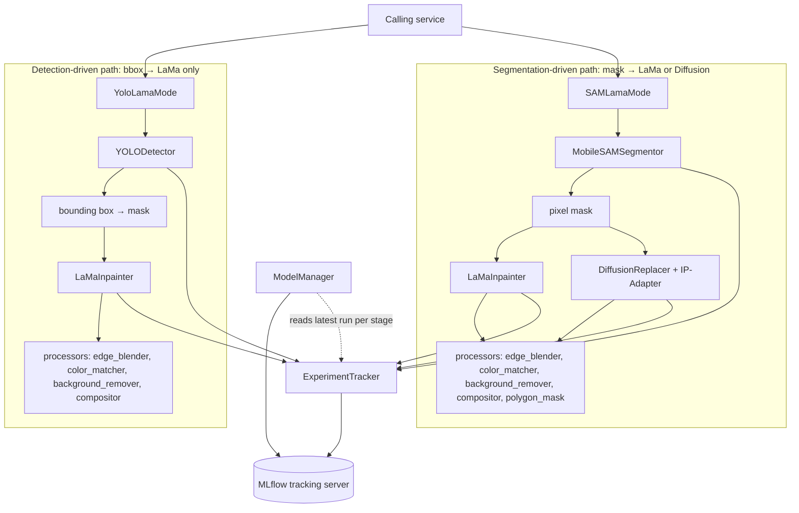

# ML Pipeline

Deep dive into `app/ml`: object detection, segmentation, mask-based inpainting, and diffusion-based object replacement, wired together into two orchestration modes and tracked through MLflow. See the [top-level README](../README.md) for the project overview, architecture, and setup instructions.

> **Scope.** This document focuses on the ML layer under `backend/app/ml`: `detector.py`, `segmentor.py`, `inpainter.py`, `diffuser_inpainter.py`, `modes/yolo_lama_mode.py`, `modes/sam_lama_mode.py`, `experiment_tracker.py`, and `model_manager.py`. These files depend on `app.config.settings`, `app.config.device_manager`, `app.core.logging`, and `app.ml.processors.*` (edge blending, color matching, background removal, compositing, polygon masking); the processor and config modules are covered only in terms of how this package calls them, not their internals.

## Overview

The package provides two independent, non-overlapping ways to find an object in a photo and edit it out or replace it:

- **Detection-driven editing** (`modes/yolo_lama_mode.py`, `YoloLamaMode`): `Image → YOLO detection → bounding box → LaMa`. YOLO locates objects with bounding boxes; the box is converted into the editing mask; removal/replacement is always done by LaMa. This path never uses diffusion.
- **Segmentation-driven editing** (`modes/sam_lama_mode.py`, `SAMLamaMode`): `Image → MobileSAM segmentation → pixel mask → LaMa **or** Diffusion`. MobileSAM produces a pixel-accurate mask, which then feeds either LaMa inpainting or Stable Diffusion + IP-Adapter generative replacement; the same mask also backs object extraction to a reusable RGBA cutout.

These are two separate pipelines, not stages of one combined flow — YOLO output never feeds MobileSAM or the diffusion path, and MobileSAM output never feeds the YOLO path. See [Why diffusion is SAM-only](#why-diffusion-is-sam-only) below for the reasoning.

Both modes are async orchestrators that call into standalone, independently usable ML components (`YOLODetector`, `MobileSAMSegmentor`, `LaMaInpainter`, `DiffusionReplacer`) and post-processing steps (edge blending, color matching, background removal, compositing — implemented in `app.ml.processors`). Every inference call is wrapped in `log_ml_operation` and logged as a single MLflow run via a shared `ExperimentTracker`, and a `ModelManager` can bundle the latest run of each pipeline stage into one versioned, registered "pipeline" artifact.

## Key Components

### Object Detection — `detector.py`
`YOLODetector` wraps Ultralytics YOLO (`weights/yolov10m.pt` by default) behind an async `detect()` call.
- Confidence thresholding and optional class-name filtering.
- Runs inference in a worker thread (`asyncio.to_thread`) so it doesn't block the event loop.
- Computes per-call metrics (detection count, avg/min/max confidence, inference time) and logs them to MLflow.
- Loaded once as a process-wide singleton via `get_detector()`.

### Segmentation — `segmentor.py`
`MobileSAMSegmentor` wraps `mobile_sam` (ViT-T backbone, a lightweight drop-in for SAM) and supports:
- **Automatic mode** — "segment everything," no prompts required, tunable via IoU threshold, stability-score threshold, minimum region area, and NMS.
- **Prompted mode** — single or batched point/bounding-box prompts.
- Same async-to-thread + metrics + MLflow pattern as the detector.

### Inpainting (removal & replacement) — `inpainter.py`
`LaMaInpainter` wraps LaMa via the `iopaint` package (not `lama-cleaner`, which it was renamed from — the docstring explicitly flags the `Config` → `InpaintRequest` API break).
- **REMOVE** mode: fills the masked region with LaMa's background generation.
- **REPLACE** mode: pastes a replacement image into the masked bbox.
- Accepts either an explicit mask or a bounding box (auto-converted to a mask).
- Mask creation is bbox-aware: when expanding a removal mask outward, it checks neighboring detections' bounding boxes and clamps the expansion so it doesn't bleed into an adjacent object.
- Uses `HDStrategy.CROP` for high-resolution images (crop → inpaint → paste back) to keep inference cost bounded.

### Diffusion-based Replacement — `diffuser_inpainter.py`
`DiffusionReplacer` performs reference-image-guided generative replacement:
- Base pipeline: `diffusers.AutoPipelineForInpainting` (default model ID `stable-diffusion-v1-5/stable-diffusion-inpainting`, configurable) with a DPM-Solver++ (Karras sigmas) scheduler.
- **IP-Adapter** (`h94/IP-Adapter`, configurable repo/variant/scale) conditions generation on a reference/asset image rather than text alone.
- Pipeline: crop to mask bbox + padding → upscale the crop to a fixed working resolution (so a small mask on a large frame doesn't get a tiny effective resolution) → run SD-inpainting with a **hard binary** mask (feathering is deferred to compositing, since soft masks confuse the model at the boundary) → decode explicitly in fp32 with a NaN check (fp16 UNet attention is unstable on some GPUs) → downscale, feather-blend, and paste back into the original frame.
- Supports CPU offload (`enable_model_cpu_offload`) and, on CUDA, VAE slicing and xFormers memory-efficient attention (used opportunistically, not required).

#### Why diffusion is SAM-only

`DiffusionReplacer` is only ever invoked from `SAMLamaMode` (`replace_object_diffusion`); `YoloLamaMode` has no code path that calls it. This is a deliberate architectural decision, not an oversight:

- Diffusion replacement is far more expensive than LaMa — a single call runs a full Stable Diffusion inpainting pass, and on the project's target hardware this takes on the order of **6–18 minutes**, versus a much faster LaMa pass.
- YOLO is primarily used to select larger, coarser bounding-box regions. Running diffusion over those larger YOLO-sized regions would push the per-call cost up by roughly another 2–3x or more, depending on region size.
- MobileSAM's pixel-accurate masks are a better fit for a generative model: precise object boundaries make diffusion's output easier to feather-blend convincingly, whereas the extra cost isn't reliably justified by a corresponding quality gain when starting from a coarse YOLO box.

So the intended shape of the system is:

- YOLO: `YOLO → bbox → LaMa` only.
- SAM: `MobileSAM → mask → LaMa` **or** `MobileSAM → mask → Diffusion + IP-Adapter`.

### Detection + LaMa orchestration — `modes/yolo_lama_mode.py`
`YoloLamaMode` composes `YOLODetector` + `LaMaInpainter` + the post-processors into a single-call API. It never touches `DiffusionReplacer` — the YOLO path is bbox → LaMa only:
- `detect_objects` — run YOLO and return detections.
- `remove_object` / `remove_multiple_objects` — bbox → mask (with neighbor-aware expansion) → LaMa remove → edge blend.
- `replace_object` — bbox → mask → LaMa replace → color match → edge blend.
- Handles YOLO's file-based inference API by writing temporary images, and exposes `get_supported_classes()` for the loaded model's class list.

### Segmentation + LaMa/Diffusion orchestration — `modes/sam_lama_mode.py`
`SAMLamaMode` composes `MobileSAMSegmentor` + `LaMaInpainter` + `DiffusionReplacer` + the post-processors. This is the only orchestrator that can call into `DiffusionReplacer`:
- `segment_objects` / `segment_with_prompt` / `segment_with_prompts_batch` / `segment_by_polygon` — the four segmentation entry points, with background/oversized-segment filtering on auto mode.
- `remove_object` — SAM mask → LaMa remove → edge blend.
- `replace_object` — SAM mask → LaMa remove → composite → color match (resized-paste style replacement).
- `replace_object_diffusion` — SAM mask → SD-inpaint + IP-Adapter → color match (generative alternative to `replace_object`, for cases where the replacement needs to match scene lighting/perspective rather than being a resized paste).
- `extract_object` / `paste_extracted_object` — SAM mask → RGBA PNG cutout, and the reverse: scale → composite → color match → edge blend a previously extracted cutout back into a (possibly different) image.

### Experiment Tracking — `experiment_tracker.py`
`ExperimentTracker` wraps MLflow (default tracking URI `http://mlflow:5000`, experiment `object-detection-system`):
- `log_run()` is the single entry point used by the components above — one call logs one MLflow run with input params, measured metrics, and tags together.
- Legacy/specific helpers (`log_detection_metrics`, `log_inpaint_metrics`, `log_batch_performance`, `log_model_comparison`) are also available.
- `get_latest_run_by_operation()` / `get_best_run()` / `get_experiment_summary()` read runs back — the former is what `ModelManager.register_pipeline()` uses to pull real, measured metrics instead of hardcoding them.

### Model Registry — `model_manager.py`
`ModelManager` wraps MLflow's model registry:
- `register_model()` — log a single model artifact + metrics/tags and register it under a name.
- `register_pipeline()` — registers **one versioned "pipeline" artifact** by pulling the latest MLflow run for each named stage (default: `detect`, `inpaint_lama_remove`, `inpaint_lama_replace`, `inpaint_diffusion_replace`, `mobilesam_segment_auto`), merging their metrics/params under namespaced keys, and writing a manifest that records exactly which run backs each stage. Missing stages are recorded in a `missing_stages` tag rather than silently zero-filled; `require_all=True` makes a missing stage a hard error instead.
- `promote_to_production()` — archives the current Production version, then promotes a target version.
- `get_model_versions()` / `compare_models()` — list registered versions and diff metrics between two versions.

## Architecture (ML layer)

`app.ml.processors.*` (edge blending, color matching, background removal, compositing, polygon masking) is imported by both orchestrators; its internals live outside this package and aren't covered here.

## Tech Stack

| Layer | Library / Model |
|---|---|
| Object detection | Ultralytics YOLO (`yolov10m.pt` by default) |
| Segmentation | `mobile_sam` (MobileSAM, ViT-T encoder) |
| Mask inpainting | `iopaint` (LaMa) |
| Generative replacement | `diffusers` (`AutoPipelineForInpainting`, DPM-Solver++ scheduler) + IP-Adapter (`h94/IP-Adapter`) |
| Experiment tracking / model registry | MLflow |
| Image processing | NumPy, Pillow, OpenCV |
| Concurrency | `asyncio.to_thread` around synchronous model inference |

## Configuration

All configuration is read from `app.config.settings`, via attribute access with fallback defaults. The names referenced by these files are:

| Setting | Used in | Purpose (as used in code) |
|---|---|---|
| `YOLO_MODEL_VERSION` | `detector.py` | Tag logged with detection metrics |
| `YOLO_DEVICE` | `detector.py` | Resolved via `DeviceManager.get()` for the detector singleton |
| `LAMA_MODEL_VERSION` | `inpainter.py` | Tag logged with inpaint metrics |
| `LAMA_DEVICE` | `inpainter.py` | Resolved via `DeviceManager.get()` for the inpainter singleton |
| `SAM_MODEL_VERSION` | `segmentor.py` | Tag logged with segmentation metrics |
| `SAM_DEVICE` | `sam_lama_mode.py` | Resolved via `DeviceManager.get()` for `SAMLamaMode` |
| `DIFFUSION_INPAINT_MODEL_ID` | `diffuser_inpainter.py` | Base SD inpainting model ID |
| `IP_ADAPTER_REPO`, `IP_ADAPTER_SUBFOLDER`, `IP_ADAPTER_IMAGE_ENCODER_SUBFOLDER`, `IP_ADAPTER_VARIANT`, `IP_ADAPTER_SCALE` | `diffuser_inpainter.py` | IP-Adapter weights and conditioning strength |
| `MLFLOW_TRACKING_URI` (env var, default `http://mlflow:5000`) | `experiment_tracker.py`, `model_manager.py` | MLflow tracking server URL |

`DeviceManager` and the full `Settings` model live outside this package (`app/config/`); this document only lists the specific settings that the ML layer reads.

## Requirements

Based on imports in this package (see `backend/requirements.txt` for exact pins):

- Python 3.x
- `ultralytics` (YOLO)
- `iopaint` (LaMa) — note the package was renamed from `lama-cleaner`; older `Config`-based code is incompatible
- `mobile_sam`
- `torch`, `diffusers`, `transformers`, `accelerate`, `safetensors` — `diffuser_inpainter.py` raises a `RuntimeError` with this exact install hint if they're missing
- `mlflow`
- `numpy`, `Pillow`, `opencv-python`

**GPU:** all four ML components accept a `device` parameter (`'cuda'` or `'cpu'`) and are usable on CPU. `DiffusionReplacer` additionally checks `device == "cuda"` to enable VAE slicing and (opportunistically) xFormers attention — these are skipped, not required, on CPU. Diffusion-based replacement is the most compute-heavy path (full SD inpainting pass per call) and will be substantially slower on CPU than detection, segmentation, or LaMa inpainting.

**Model weights:** weight files (`.pt` / `.onnx`) are not committed to Git — only `.gitkeep` placeholders live under `backend/weights/` to preserve the directory layout. Weights are fetched separately with `scripts/download-models.sh` (bash) or `scripts/download-models.ps1` (PowerShell), which download the same four assets to the same destinations on both platforms:

| Model | Source | Destination |
|---|---|---|
| YOLOv10m | `ultralytics/assets` GitHub release (`v8.4.0`) | `backend/weights/yolov10m.pt` |
| MobileSAM | `ultralytics/assets` GitHub release (`v8.4.0`) | `backend/weights/mobile_sam.pt` |
| Big-LaMa | `Sanster/models` GitHub release (`add_big_lama`) | `backend/weights/lama_cache/big-lama.pt` |
| U2Net (rembg) | `danielgatis/rembg` GitHub release (`v0.0.0`) | `backend/weights/rembg/u2net.onnx` |

Both scripts skip a download if the destination file already exists, retry on failure, and fail loudly if a downloaded file ends up empty. U2Net backs the background-removal processor (`app.ml.processors.background_remover`), not one of the eight core files above, but is fetched by the same scripts alongside the detection/segmentation/inpainting weights.

## Testing

`backend/tests/` is organized into layers, each with a pytest marker (`unit`, `integration`, `smoke`, `gpu`, defined in `backend/tests/pytest.ini`):

- **Unit tests** (`tests/unit/ml/`) — isolated ML components and logic: `test_detector.py`, `test_segmentor.py`, `test_inpainter.py`, `test_diffuser_inpainter.py`, `test_experiment_tracker.py`, `test_model_manager.py`, plus dedicated subfolders for the orchestration modes (`unit/ml/modes/`), the `pipeline/` mixins (`unit/ml/pipeline/`), and the post-processors (`unit/ml/processors/`).
- **Integration tests** (`tests/integration/ml/`) — interaction between ML components and the rest of the app: `test_yolo_detector_integration.py`, `test_segmentor_integration.py`, `test_inpainter_integration.py`, `test_diffuser_integration.py`, `test_yolo_lama_mode_integration.py`, `test_sam_lama_mode_integration.py`, and a `pipeline/` subfolder for the combined `MLPipeline` orchestrator.
- **Smoke tests** (`tests/smoke/`) — fast, basic end-to-end checks of key ML-adjacent flows (`test_detection.py`, `test_segmentation.py`, `test_editing.py`, alongside auth/upload/health/worker smoke coverage), run on every PR.
- **GPU tests** (marked `gpu`) — model/inference tests that require a CUDA-capable environment and the real downloaded weights, run via the dedicated `GPU Tests` GitHub Actions workflow (`.github/workflows/gpu_tests.yml`) on a self-hosted GPU runner, either manually or per test suite (`yolo`, `sam`, `lama`, `diffusion`). They are excluded from the regular unit/integration/smoke CI runs.

## Limitations

- This document covers the ML pipeline layer under `backend/app/ml`; the surrounding application (API, storage, auth, frontend) is described only where it directly touches this package.
- Exact behavior inside `app.ml.processors.*` (mask feathering/blending logic, color-matching algorithm), `app.config.device_manager`, and `app.core.logging` is out of scope for this document — only how the ML layer calls into them is covered.
- Diffusion-based replacement runs a full Stable Diffusion inpainting pass per call and is the most latency- and memory-sensitive operation in the pipeline, which is also why it's restricted to the segmentation path (see [above](#why-diffusion-is-sam-only)).
